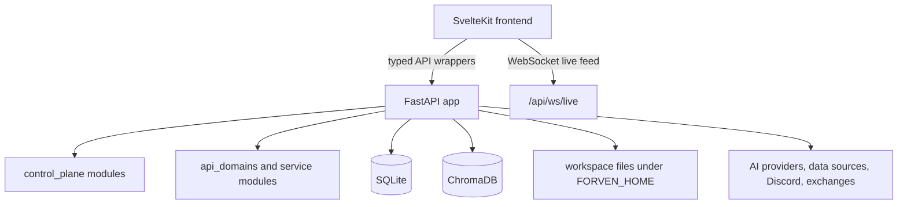

# Forven Architecture

## Overview

Forven is a local-first trading operations framework with three main layers:

1. A SvelteKit frontend for operator workflows
2. A FastAPI backend for APIs, orchestration, and compatibility routes
3. Local persistence and workspace state centered on SQLite and `FORVEN_HOME`

## Frontend

The frontend lives in `frontend/`.

Current frontend stack:

- SvelteKit 2
- Svelte 5
- Tailwind CSS
- Vite
- Vitest and Playwright for test coverage

Important frontend conventions:

- API access belongs in `frontend/src/lib/api/`
- Shared state belongs in `frontend/src/lib/stores/`
- Reusable components live in `frontend/src/lib/components/`
- Route shells live in `frontend/src/routes/`

### Current route surface

The active route tree includes:

- `/`
- `/agents`
- `/ai-dropzone`
- `/approval`
- `/data`
- `/lab`
- `/lab/strategy/[id]`
- `/memory`
- `/ops`
- `/risk`
- `/runs`
- `/settings`
- `/tasks`
- `/trades`

The dashboard also supports `/?view=quant_factory` and `/?view=beta`.

### Frontend-backend connection

- The Vite dev server proxies `/api` and `/health` to the backend
- Frontend API resolution also supports direct backend access on port `8003`
- Live updates use the WebSocket endpoints exposed by the backend

## Backend

The FastAPI app is assembled in `forven/api.py`.

Key app responsibilities:

- Register routers
- Apply CORS
- Apply `ForvenV1CompatMiddleware`
- Run startup initialization through `forven.api_core._on_startup`
- Expose the health endpoints and websocket routes used by the frontend

### Router surface

The registered router set currently includes:

- `status`
- `notifications`
- `memory`
- `approvals`
- `ops`
- `analytics`
- `data`
- `tasks`
- `trading`
- `paper`
- `jobs`
- `legacy`
- `system`
- `auth`
- `agents`
- `strategies`
- `websockets`
- `quant_factory`
- `webhooks`
- `backtesting`
- `lifecycle`
- `simulation`
- `verdict`
- `robustness`

### Backend organization

The repo uses several layers instead of a single monolith:

- `forven/routers/`: HTTP and websocket route definitions
- `forven/control_plane/`: operator-facing runtime behavior such as status, ops, approvals, and notifications
- `forven/api_domains/`: extracted API-facing domain logic and compatibility helpers
- `forven/strategies/`: strategy base classes, registry, optimization, and backtesting helpers
- `forven/api_core.py`: shared compatibility, startup, and legacy behavior that has not yet been fully extracted

### Compatibility layer

`ForvenV1CompatMiddleware` and the legacy routes keep older `/api/forven/*` clients working while the current frontend and newer APIs use the newer route layout.

## Persistence and Local State

### SQLite

SQLite is the main system of record for:

- strategies and lifecycle events
- backtest results and related artifacts
- tasks and audit logs
- approvals
- notifications
- scheduler state
- trades and positions
- settings and KV runtime state

The core implementation lives in `forven/db.py`.

### Workspace and auth state

Runtime state defaults to `~/.forven` unless `FORVEN_HOME` is set. Important files and directories include:

- `forven.db`
- `auth.json`
- `config.json`
- `workspace/`

### Memory layer

ChromaDB is used for memory and retrieval-style workflows. The frontend exposes this through the `/memory` route and the backend memory router.

## Startup Model

### Windows launcher

`start_all.ps1` is the most complete bootstrap path on Windows. It:

- creates or repairs `.venv`
- installs backend dependencies if missing
- installs frontend dependencies if missing
- initializes the database
- starts backend, frontend, and optional bot/daemon services

### Unix launcher

`start_all.sh` starts backend, frontend, and optional bot/daemon services after dependencies are already installed. It also loads `.env` automatically when present.

## Health and Realtime Endpoints

- Backend health: `/api/health`
- Compatibility health: `/health`
- System status: `/api/system/status`
- Soak report: `/api/system/soak-report`
- Live websocket: `/api/ws/live` and `/ws/live`

## Trading Execution Layer (Brokers & Risk)

Forven supports multi-asset execution through a unified `Broker` protocol while explicitly separating the underlying market mechanics (e.g., Crypto vs. Forex).

### Broker Router

The execution path uses `BrokerRouter` to dispatch trades based on the asset class of the traded symbol:
- **Crypto:** Routed to `HyperliquidBroker` (REST/WS API, wallet-based auth).
- **Forex:** Routed to `MT5Broker` (via MetaTrader 5 terminal, login/password auth), gated by the `FORVEN_ENABLE_FOREX` feature flag.

### Risk Management

To prevent systemic failures across asset classes, risk is managed on a **shared chassis but partitioned mathematically**:
- **Budget Partitioning:** The global risk budget is split into strict fractional allocations (e.g., 70% Crypto, 30% Forex). Losses in one asset class cannot consume the other's budget.
- **Concurrent Positions:** Maximum open position limits are tracked independently per asset class.
- **Kill-Switches:** The daily loss limit can be configured to trigger per-broker/asset-class or globally.
- **Cost Models:** Execution cost models are strictly separate. Crypto models standard taker/maker fees and funding rates, whereas Forex probabilistically models session-aware spreads and directional overnight swap/rollover costs (`costs_forex.py`).

## Development Rules

- Use absolute Python imports
- Keep backend routers thin
- Add frontend API wrappers instead of raw component fetches
- Treat `forven/exchange/` as sensitive integration code (all check-then-act sequences must use the atomic `try_open_position` lock)
- Update docs when route surfaces, startup flows, or operator behavior change
